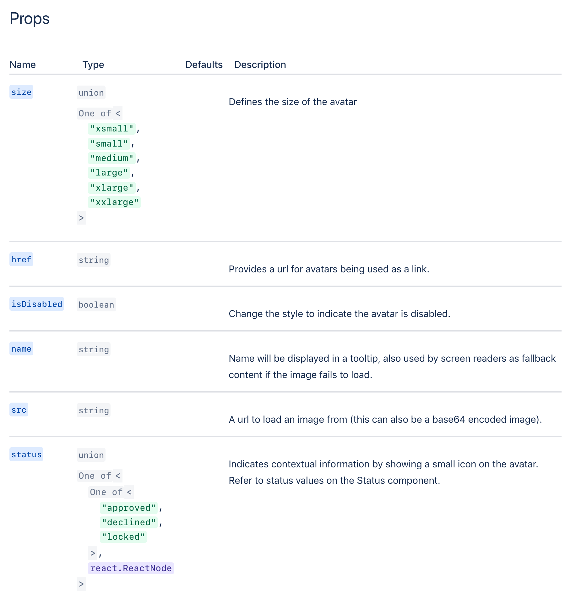

# Extract React Types

> One stop shop to document your react components.

<p align="center">
  
</p>

## Getting started 🏁

### Step 1: Install

`npm install --save-dev babel-plugin-extract-react-types pretty-proptypes`

### Step 2: Annotate your prop types

```typescript
export interface AvatarPropTypes {
  /** Provides a url for avatars being used as a link. */
  href?: string;
  /** Defines the size of the avatar */
  size?: 'small' | 'medium' | 'large';
  /** Name will be displayed in a tooltip */
  name?: string;
  /** A url to load an image from (this can also be a base64 encoded image). */
  src?: string;
  /** A `testId` prop is provided for specified elements, which is a unique string that appears as a data attribute `data-testid` in the rendered code, serving as a hook for automated tests */
  testId?: string;
}
```

### Step 3: Output prop types

pretty-proptypes can display props from two sources.

**Option 1.** Using [babel-plugin-extract-react-types](./packages/babel-plugin-extract-react-types) and passing the component to Props

`.babelrc`

```json
{
  "plugins": ["babel-plugin-extract-react-types"]
}
```

```jsx
import { Props } from 'pretty-proptypes';
import MyCoolComponent from '../MyCoolComponent';

<Props heading="My Cool Component" component={MyCoolComponent} />;
```

**Option 2.** Directly passing a component's props to Props with [extract-react-types-loader](./packages/extract-react-types-loader) or getting types from [extract-react-types](./packages/extract-react-types) and writing it to a file

```jsx
import { Props } from 'pretty-proptypes';

<Props
  heading="My Cool Component"
  props={require('!!extract-react-types-loader!../MyCoolComponent')}
/>;
```

This analyses prop type definitions, and default props. It creates descriptions from comments before the type definitions, and will render markdown syntax using [react-markings](https://www.npmjs.com/package/react-markings).

## Packages

1. [extract-react-types](./packages/extract-react-types) _Extract Flow & TypeScript types from React Components_
2. [extract-react-types-loader](./packages/extract-react-types-loader) _Webpack loader for extract-react-types_
3. [babel-plugin-extract-react-types](./packages/babel-plugin-extract-react-types) _A Babel plugin to store the types of React components as a property on the component for documentation_
4. [kind2string](./packages/kind2string) _kind2string is designed to take the data structures output by extract-react-types and convert it down to a (useful) string._
5. [pretty-proptypes](./packages/pretty-proptypes) _PrettyPropTypes is designed to display the output of extract-react-types and display rich prop information for consumers._

## Contribute

Pull requests, issues and comments welcome - please read our [contributing guidelines](./contributing.md) and our [code of conduct](./code-of-conduct.md).

[](https://atlassian.com)
